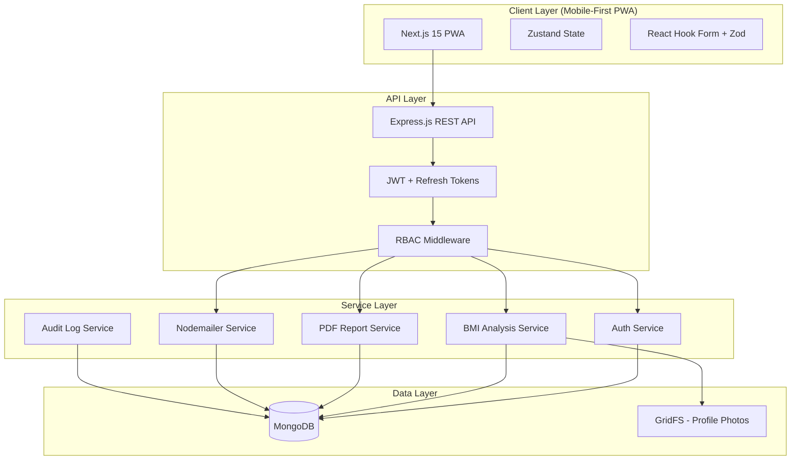
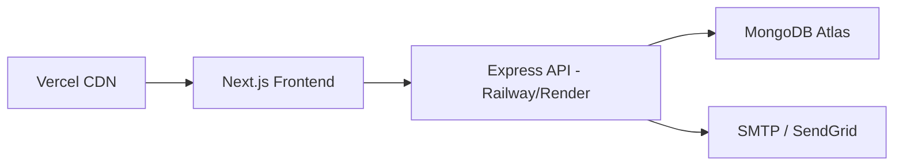

# System Architecture

## High-Level Overview



## Backend Architecture

```
backend/src/
├── app.ts              # Express app bootstrap
├── server.ts           # HTTP server entry
├── config/
│   ├── database.ts     # Mongoose connection
│   ├── env.ts          # Environment validation
│   └── cors.ts
├── middleware/
│   ├── auth.ts         # JWT verification
│   ├── rbac.ts         # Permission checks
│   ├── validate.ts     # Zod/Joi request validation
│   ├── audit.ts        # Activity logging
│   └── errorHandler.ts
├── models/             # Mongoose schemas (10 collections)
├── routes/             # Route definitions
├── controllers/        # Request handlers
├── services/           # Business logic
├── utils/
│   ├── bmi.ts          # BMI calculation & classification
│   ├── bodyComposition.ts
│   ├── jwt.ts
│   ├── otp.ts
│   └── pagination.ts
└── validators/         # Request schemas
```

### Request Flow

1. Client sends request with `Authorization: Bearer <accessToken>`
2. `auth` middleware verifies JWT, attaches `req.user`
3. `rbac` middleware checks role permissions for the route
4. `validate` middleware validates request body/params
5. Controller delegates to service layer
6. Service performs business logic, writes to MongoDB
7. `audit` middleware logs significant actions
8. Standardized JSON response returned

## Frontend Architecture

```
frontend/src/
├── app/
│   ├── (auth)/           # Login, Register, Forgot Password
│   ├── (dashboard)/
│   │   ├── owner/        # Owner dashboard & backoffice
│   │   ├── staff/        # Staff dashboard & workflows
│   │   └── member/       # Member dashboard & history
│   ├── layout.tsx
│   └── page.tsx          # Landing / redirect
├── components/
│   ├── ui/               # Shadcn primitives
│   ├── layout/           # Bottom nav, sidebar, header
│   ├── charts/           # Recharts wrappers
│   ├── forms/            # Member, BMI, diet forms
│   └── reports/          # PDF preview, print
├── stores/
│   ├── authStore.ts
│   ├── themeStore.ts
│   └── notificationStore.ts
├── lib/
│   ├── api.ts            # Axios/fetch client with refresh
│   ├── utils.ts
│   └── constants.ts
├── hooks/
│   ├── useAuth.ts
│   └── usePermissions.ts
└── types/
    └── index.ts
```

### Mobile-First Design Principles

- **Bottom navigation** on mobile (< 768px)
- **Collapsible sidebar** on desktop (≥ 768px)
- **Touch targets** minimum 44×44px
- **Responsive tables** → card layout on mobile
- **PWA manifest** + service worker for offline shell
- **80/20 split**: optimize layouts for 375px viewport first

## Multi-Gym Support (Future-Ready)

All tenant-scoped collections include `gymId` field:

```typescript
interface TenantScoped {
  gymId: ObjectId;  // References Settings.gym document
}
```

Enables future multi-tenant SaaS without schema migration.

## Security

| Concern | Implementation |
|---------|----------------|
| Authentication | JWT (15m) + Refresh Token (7d) in httpOnly cookie |
| Password | bcrypt (12 rounds) |
| OTP | 6-digit, 10min TTL, hashed storage |
| RBAC | Role → Permission mapping, middleware enforcement |
| Rate limiting | express-rate-limit on auth routes |
| Input validation | Zod on both client and server |
| Audit | All CRUD on members/BMI logged |

## Deployment Topology


