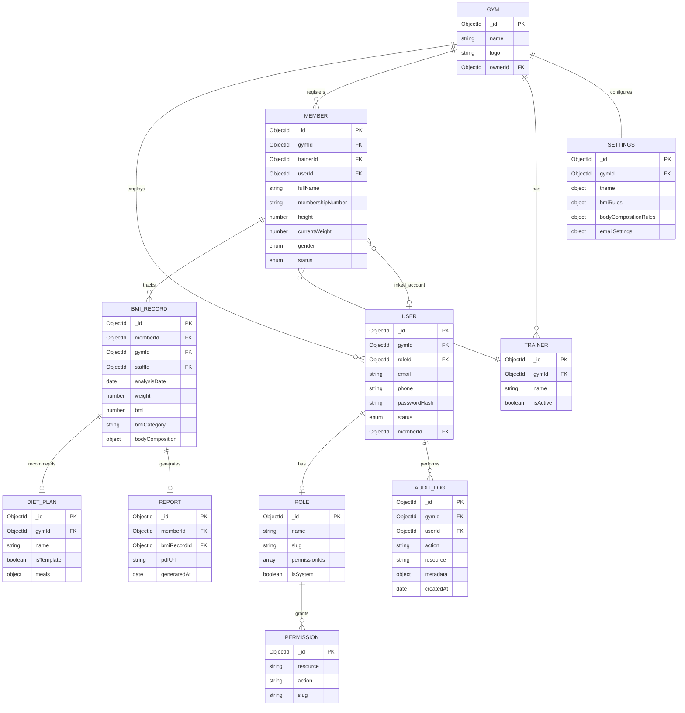

# Database Design

## ER Diagram



## Collections Summary

| Collection | Purpose | Key Indexes |
|------------|---------|-------------|
| `users` | Auth accounts (owner, staff, member) | `email`, `phone`, `gymId+roleId` |
| `roles` | RBAC roles | `slug` (unique) |
| `permissions` | Granular permissions | `slug` (unique) |
| `members` | Gym member profiles | `gymId+membershipNumber`, `gymId+email`, `trainerId` |
| `bmirecords` | Body analysis sessions | `memberId+analysisDate`, `gymId+analysisDate` |
| `dietplans` | Diet templates & assignments | `gymId+isTemplate` |
| `trainers` | Trainer directory | `gymId+name` |
| `reports` | Generated PDF metadata | `memberId+generatedAt` |
| `settings` | Gym config (theme, rules) | `gymId` (unique) |
| `auditlogs` | Activity tracking | `gymId+createdAt`, `userId+createdAt` |

## Design Decisions

### Embed vs Reference

| Data | Strategy | Reason |
|------|----------|--------|
| BMI body composition fields | Embed in `bmirecords` | Always read with analysis |
| Diet meal schedule | Embed in `dietplans` | Template is self-contained |
| BMI rules / theme | Embed in `settings` | Single document per gym |
| Member → Trainer | Reference | Trainer reused across members |
| BMI history | Separate collection | Unbounded growth (1:many) |

### BMI Record Document Shape

```json
{
  "_id": "ObjectId",
  "memberId": "ObjectId",
  "gymId": "ObjectId",
  "staffId": "ObjectId",
  "analysisDate": "2026-06-11",
  "weight": 78.5,
  "height": 170,
  "bmi": 27.2,
  "bmiCategory": "Obesity Grade 1",
  "healthRisk": "Increased risk of cardiovascular disease",
  "suggestedAction": "Consult trainer for structured weight loss program",
  "bodyComposition": {
    "bodyFatPercent": 22.5,
    "visceralFat": 9,
    "visceralFatStatus": "normal",
    "bmr": 1650,
    "bodyAge": 35,
    "totalBodyFat": 17.6,
    "trunkFat": 14.2,
    "armFat": 2.1,
    "legFat": 5.3,
    "muscleMass": 34.2
  },
  "dietPlanId": "ObjectId",
  "trainerNotes": "Focus on cardio 4x/week",
  "createdAt": "ISO8601",
  "updatedAt": "ISO8601"
}
```

### Member Status Flow

```
pending_approval → active → inactive → archived
         ↑
    self_register
```

## Index Strategy

- **Compound indexes** match query patterns: `{ gymId: 1, analysisDate: -1 }`
- **Unique constraints**: `membershipNumber` per gym, `email` per gym for members
- **TTL index** on OTP documents (if stored separately): 600 seconds
- **Text index** on `members.fullName` for search

## Schema Validation

Mongoose schemas enforce types at application level. Optional MongoDB `$jsonSchema` validators can be added in production for defense-in-depth.
