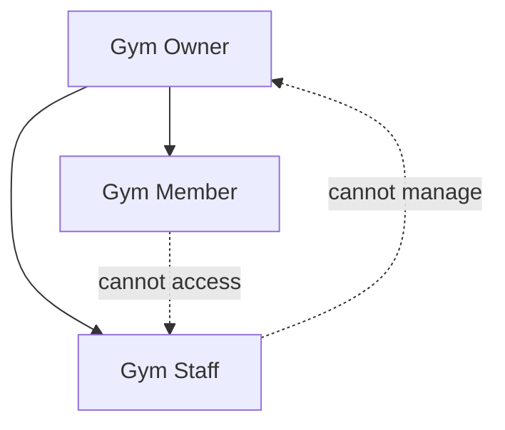

# RBAC Architecture

## Role Hierarchy



## Default Roles

| Role | Slug | Description |
|------|------|-------------|
| Gym Owner | `owner` | Full system access |
| Gym Staff | `staff` | Operational access |
| Gym Member | `member` | Self-service only |

## Permission Model

Permissions follow `resource:action` pattern:

```
members:create
members:read
members:update
members:delete
members:approve
bmi:create
bmi:read
bmi:update
bmi:delete
reports:create
reports:read
reports:email
diet:create
diet:read
diet:update
diet:delete
trainers:create
trainers:read
trainers:update
trainers:delete
settings:read
settings:update
rbac:create
rbac:read
rbac:update
rbac:delete
staff:create
staff:read
staff:update
staff:delete
analytics:read
audit:read
export:read
```

## Permission Matrix

| Permission | Owner | Staff | Member |
|------------|:-----:|:-----:|:------:|
| members:create | ✅ | ✅ | ❌ |
| members:read | ✅ | ✅ (assigned) | ✅ (self) |
| members:update | ✅ | ✅ | ✅ (self) |
| members:delete | ✅ | ❌ | ❌ |
| members:approve | ✅ | ❌ | ❌ |
| bmi:create | ✅ | ✅ | ❌ |
| bmi:read | ✅ | ✅ | ✅ (self) |
| bmi:update | ✅ | ✅ | ❌ |
| bmi:delete | ✅ | ❌ | ❌ |
| reports:create | ✅ | ✅ | ❌ |
| reports:read | ✅ | ✅ | ✅ (self) |
| reports:email | ✅ | ✅ | ❌ |
| diet:* | ✅ | read | read (assigned) |
| trainers:* | ✅ | read | read |
| settings:* | ✅ | ❌ | ❌ |
| rbac:* | ✅ | ❌ | ❌ |
| staff:* | ✅ | ❌ | ❌ |
| analytics:read | ✅ | ❌ | ❌ |
| audit:read | ✅ | ❌ | ❌ |
| export:read | ✅ | ❌ | ❌ |

## Middleware Flow

```typescript
// Route example
router.post(
  '/members',
  authenticate,                    // Verify JWT
  requirePermission('members:create'), // Check RBAC
  validate(createMemberSchema),    // Zod validation
  auditLog('member.create'),       // Log action
  memberController.create
);
```

## Data Scoping Rules

### Staff Scope

Staff can only access members where:
- `member.trainerId` matches staff's linked trainer, OR
- `member.createdBy` equals staff user ID

Configurable per gym in settings.

### Member Scope

Members can only access:
- Their own `memberId` linked via `user.memberId`
- Their own BMI records and reports

### Owner Scope

Full access to all data within their `gymId`.

## Custom Roles (Future)

Owners can create custom roles by selecting permission subsets. System roles (`owner`, `staff`, `member`) cannot be deleted but permissions can be extended.
