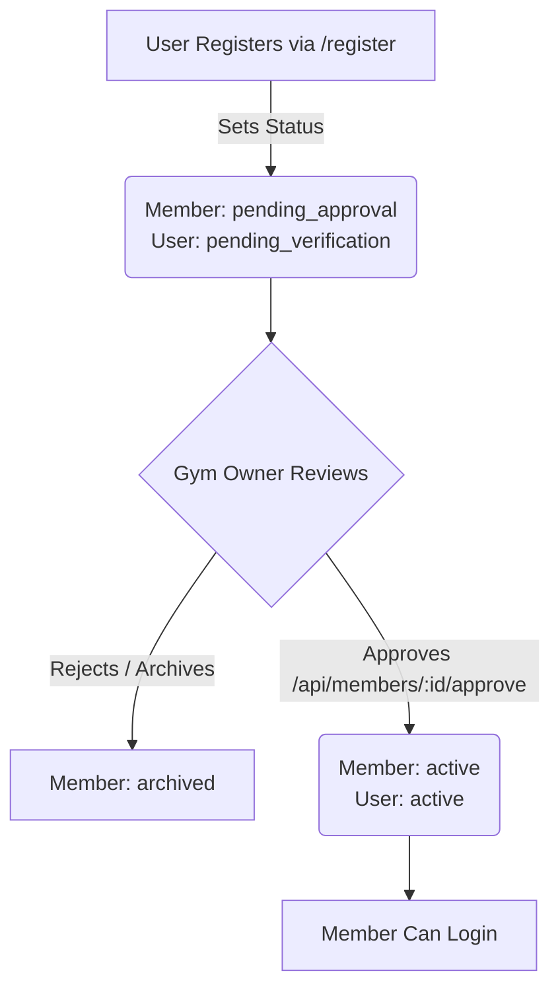

# Member Approval Workflow Documentation

This document outlines the design and implementation of the **Member Approval Workflow** introduced in Phase 2.

## Workflow Overview

Self-registered members go through a structured approval flow before they are allowed to log in and use the gym's features.

---

## Technical Details

### 1. Registration (`POST /api/auth/register`)
- Self-registered users are created in the database with:
  - `Member.status = "pending_approval"`
  - `User.status = "pending_verification"`
- Trying to log in with these credentials returns a `403 Forbidden` response: `"Account pending approval or inactive"`.

### 2. Approval API (`POST /api/members/:id/approve`)
- Accessible to users with `members:approve` permission (Gym Owners).
- Updates `Member.status` to `"active"`.
- Locates the associated `User` record via `member.userId` and updates its status to `"active"`.
- Writes an audit log entry (`member.approve`).

---

## User Interface Elements

### 1. Owner Dashboard Quick Approvals
- **Path:** `frontend/src/app/(dashboard)/owner/page.tsx`
- Lists recent registrations.
- Displays an inline **Approve** button for any member whose status is `pending_approval`. Clicking this button triggers the approval API and reloads dashboard metrics.

### 2. Shared Member Details Action
- **Path:** `frontend/src/components/members/MemberDetails.tsx`
- Displays a prominent green **Approve Registration** button at the top header for users with approval permissions when viewing a pending member.

### 3. Shared Member List Status Filter
- **Path:** `frontend/src/components/members/MembersList.tsx`
- Adds a status dropdown selector including **Pending Approval** so owners and staff can filter down to self-registered members awaiting review.
