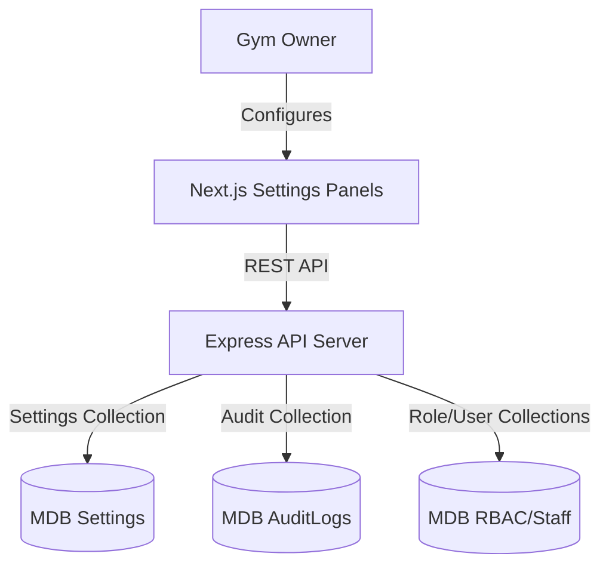

# Phase 5: Backoffice & Settings Overview

This phase implements the owner configuration panel, allowing system-wide customization, security role definitions, staff management, and system auditing.

## Architecture & Integration

### 1. Settings Collection Structure
The central configurations are stored in the single-document `Settings` schema. This collection maps directly to a `gymId` and holds:
- **Theme Configurations:** CSS HSL color definitions, footer brand markings, and file links to custom logo resources.
- **BMI Classification Thresholds:** WHO-based categories or custom fitness categories used to parse user body compositions during recorded sessions.
- **Body Composition Rules:** Threshold ranges for visceral fat, trunk fat, body fat (gender-segregated), and muscle mass.
- **SMTP Server Configuration:** Connection credentials used to switch email notification dispatches from mock terminal logs to custom SMTP mail delivery networks.

### 2. Staff & User Hierarchy
Staff records in this system utilize a two-document linking architecture:
1. **User document:** Handles authorization status, credentials hash, and dynamic reference keys to RBAC `Role` documents.
2. **Member document:** Stores user profile fields (Full Name, Contact details) with a flag `role: 'staff'`.

### 3. Auditing Architecture
All updates, creations, and deletions triggered by system managers are recorded via the `auditLog` Express middleware wrapper. It hooks Express response streams (`res.json`) to log metadata (such as browser agents, remote IP addresses, and request endpoints) asynchronously without blocking responses.
